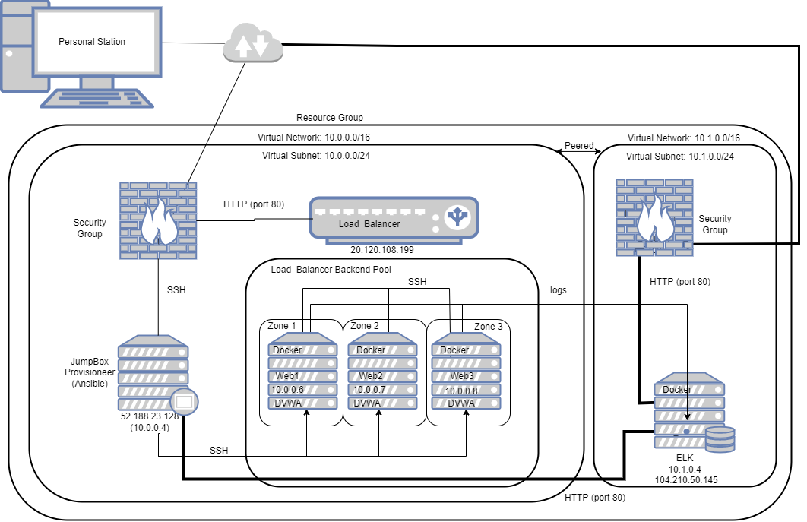

## Automated ELK Stack Deployment

The files in this repository were used to configure the network depicted below.



These files have been tested and used to generate a live ELK deployment on Azure. They can be used to either recreate the entire deployment pictured above. Alternatively, select portions of the playbook file may be used to install only certain pieces of it, such as Filebeat.

```
---
- name: Configure Elk VM with Docker
  hosts: elk
  remote_user: azuser
  become: true
  tasks:
    - name: Install docker.io
      apt:
        update_cache: yes
        name: docker.io
        state: present

    - name: Install pip3
      apt:
        force_apt_get: yes
        name: python3-pip
        state: present

    - name: Install Docker python module
      pip:
        name: docker
        state: present

    - name: Increase virtual memory
      command: sysctl -w vm.max_map_count=262144

    - name: Use more memory
      sysctl:
        name: vm.max_map_count
        value: "262144"
        state: present
        reload: yes

    - name: download and launch a docker elk container
      docker_container:
        name: elk
        image: sebp/elk:761
        state: started
        restart_policy: always
        published_ports:
          - 5601:5601
          - 9200:9200
          - 5044:5044
```

This document contains the following details:
- Description of the Topology
- Access Policies
- ELK Configuration
  - Beats in Use
  - Machines Being Monitored
- How to Use the Ansible Build


### Description of the Topology

The main purpose of this network is to expose a load-balanced and monitored instance of DVWA, the D*mn Vulnerable Web Application.

Load balancing ensures that the application will be highly available in addition to restricting inbound access to the network. Loan balancers assist in monitoring inbound trafficer to web servers, they are a gate point only allowing authorized users (via IP) further access to connect.

Integrating an ELK server allows users to easily monitor the vulnerable VMs for changes to the file systems and system metrics. An ELK server assists with monitoring ssh attempt, sudo failures, IP addresses, geographic location, CPU usages, etc.

For the purposes of this deployment, our load balancer carries all machines barring the Jumpbox within two separate availablity zones. Our web servers exist within one and our ELK server exists within the second. 

The configuration details of each machine may be found below.

| Name       | Function          | IP Address              | Operating System |
|------------|-------------------|-------------------------|------------------|
| Jumpbox    | Gateway           | 52.188.23.128/10.0.0.4  | Linux            |
| Web1       | Web Server (DVWA) | 10.0.0.6                | Linux            |
| Web2       | Web Server (DVWA) | 10.0.0.7                | Linux            |
| Web3       | Web Server (DVWA) | 10.0.0.8                | Linux            |
| ELK-Server | Metric Monitoring | 10.1.0.4                | Linux            |

### Access Policies

The machines on the internal network are not exposed to the public Internet. 

Only the Jumpbox machine can accept connections from the Internet. Access to this machine is only allowed from the following IP addresses: 67.4.39.44

Machines within the network can only be accessed by via the jumpbox through its firewall. The web servers (DVWA) send and transmit data to the ELK server - 10.1.0.4.

A summary of the access policies in place can be found in the table below.

| Name    | Publicly Accessible | Permissible IP Addresses |
|---------|---------------------|--------------------------|
| Jumpbox | Yes                 | xx.x.xx.44               |
| Web1    | No                  | 10.0.0.4                 |
| Web2    | No                  | 10.0.0.4                 |
| Web3    | No                  | 10.0.0.4                 |
| ELK     | No                  | xx.x.xx.44               |

### Elk Configuration

Ansible was used to automate configuration of the ELK machine. No configuration was performed manually, which is advantageous because by doing so you can limit the services running, streamline the installation and update and make the process easily replicable through the use of a single command rather than many. 

The playbook implements the following tasks:
- Install Docker
- Install pip3
- Install Docker's Python Module
- Increase memory space
- Download and launch the ELK container


The following screenshot displays the result of running `docker ps` after successfully configuring the ELK instance.


### Target Machines & Beats
This ELK server is configured to monitor the following machines:
- Web1: 10.0.0.6
- Web2: 10.0.0.7
- Web3: 10.0.0.8

We have installed the following Beats on these machines:
- Filebeat
- Metricbeat

These Beats allow us to collect the following information from each machine:
- Filebeat collects the log data sent from the web servers. It monitors the log directories and distributes them for indexing for easier viewing and interpreting.
- Metricbeat coolects the metrics and statistics from the servers systems. It tracks information such as CPU and memory usage. 

### Using the Playbook
In order to use the playbook, you will need to have an Ansible control node already configured. Assuming you have such a control node provisioned: 

SSH into the control node and follow the steps below:
- Copy the configuration file to Ansible container.
- Update the hosts file to include the IP address of both ELK and webservers.
- Run the playbook, and navigate to http://104.210.50.145:5601/app/kibana to check that the installation worked as expected.

- _Which file is the playbook? Where do you copy it?_ The configuration file. /etc/ansible/files/filebeat-config.yml to /etc/filebeat/filebeat.yml
- _Which file do you update to make Ansible run the playbook on a specific machine? How do I specify which machine to install the ELK server on versus which to install Filebeat on?_ the filebeat-config.yml file. You need to specify which machines to install it only and update which ip addresses/group the playbook should run on.
- _Which URL do you navigate to in order to check that the ELK server is running?_ http://104.210.50.145:5601/app/kibana

_As a **Bonus**, provide the specific commands the user will need to run to download the playbook, update the files, etc._

### Filebeat
```
---
- name: Installing and Launch Filebeat
  hosts: webservers
  become: yes
  tasks:
    # Use command module
  - name: Download filebeat .deb file
    command: curl -L -O https://artifacts.elastic.co/downloads/beats/filebeat/filebeat-7.4.0-amd64.deb

    # Use command module
  - name: Install filebeat .deb
    command: dpkg -i filebeat-7.4.0-amd64.deb

    # Use copy module
  - name: Drop in filebeat.yml
    copy:
      src: /etc/ansible/files/filebeat-config.yml
      dest: /etc/filebeat/filebeat.yml

    # Use command module
  - name: Enable and Configure System Module
    command: filebeat modules enable system

    # Use command module
  - name: Setup filebeat
    command: filebeat setup

    # Use command module
  - name: Start filebeat service
    command: service filebeat start

    # Use systemd module
  - name: Enable service filebeat on boot
    systemd:
      name: filebeat
      enabled: yes
```

### Metricbeat
```
---
- name: Install metric beat
  hosts: webservers
  become: true
  tasks:
    # Use command module
  - name: Download metricbeat
    command: curl -L -O https://artifacts.elastic.co/downloads/beats/metricbeat/metricbeat-7.6.1-amd64.deb

    # Use command module
  - name: install metricbeat
    command: dpkg -i metricbeat-7.6.1-amd64.deb

    # Use copy module
  - name: drop in metricbeat config
    copy:
      src: /etc/ansible/files/metricbeat-config.yml
      dest: /etc/metricbeat/metricbeat.yml

    # Use command module
  - name: enable and configure docker module for metric beat
    command: metricbeat modules enable docker

    # Use command module
  - name: setup metric beat
    command: metricbeat setup

    # Use command module
  - name: start metric beat
    command: service metricbeat start

    # Use systemd module
  - name: enable service metricbeat on boot
    systemd:
      name: metricbeat
      enabled: yes
```
